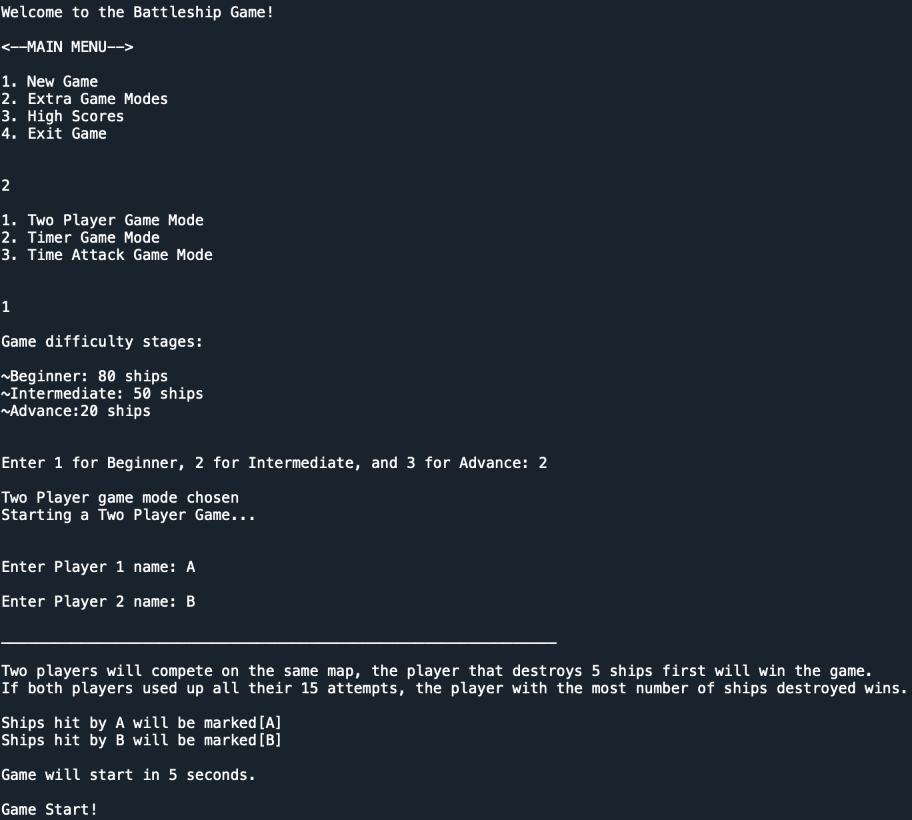
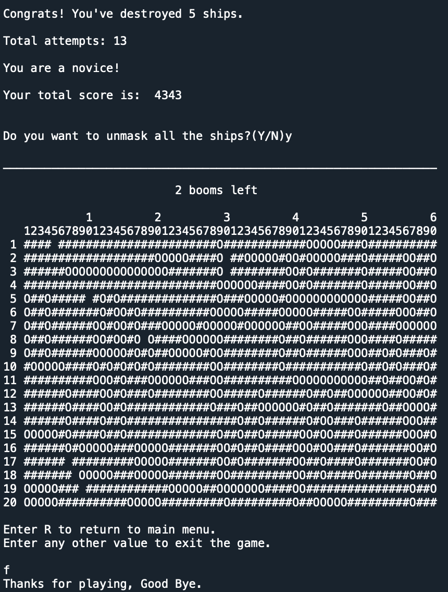

# BattleshipPY
Simple Battleship Game developed using Python.

## Running the algorithm
- Put the main.py and savefile.txt files in the same directory, and run main.py using any Python IDE.  

## Problem Description
The aim of my codes is to build a non-graphical simple battleship game which supports multiple game modes and difficulties using Python. In addition, I've added the functionality to save top 10 high scores into a savefile.txt which is placed in the same directory with the main code file.

## Expected Outputs

## Built On/With
Built On : Python  
Built With : Atom
